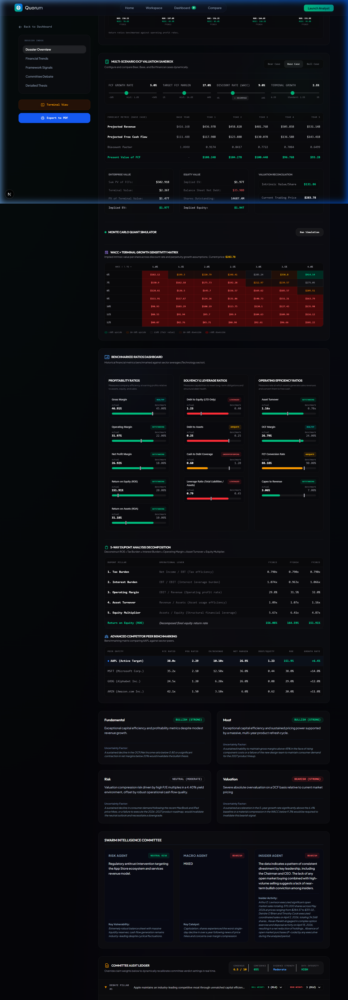
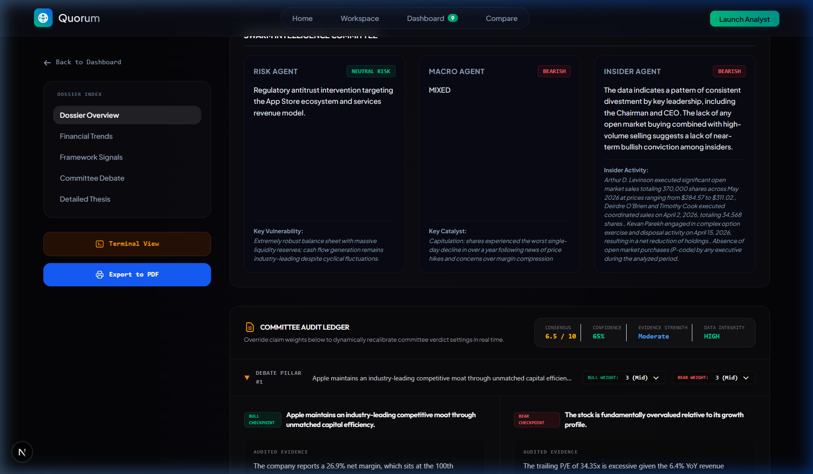
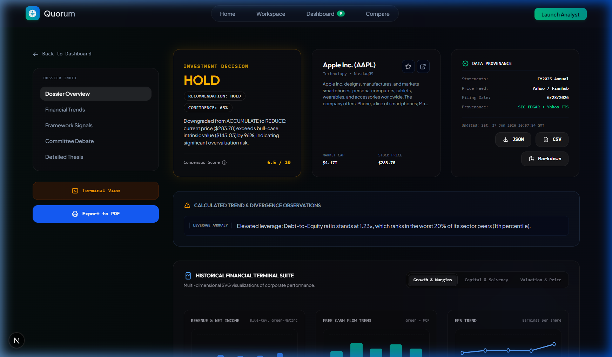
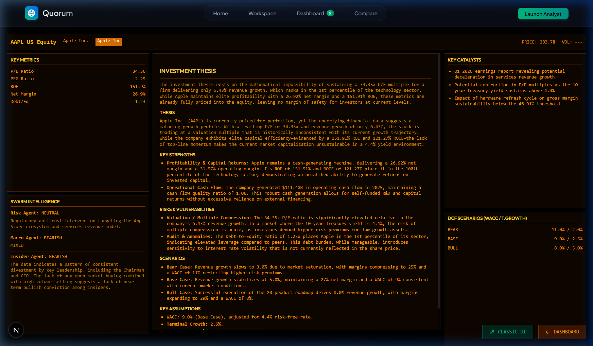
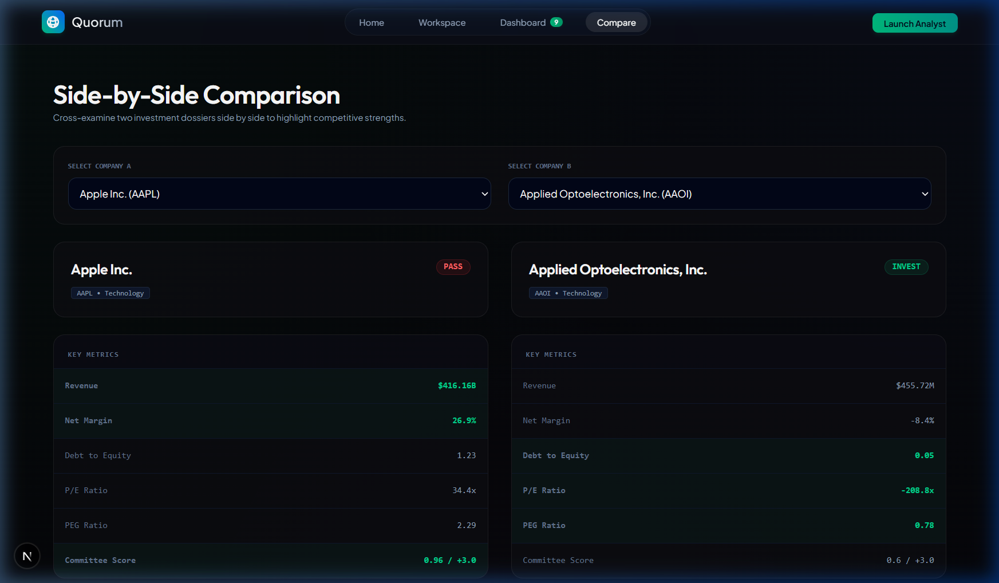
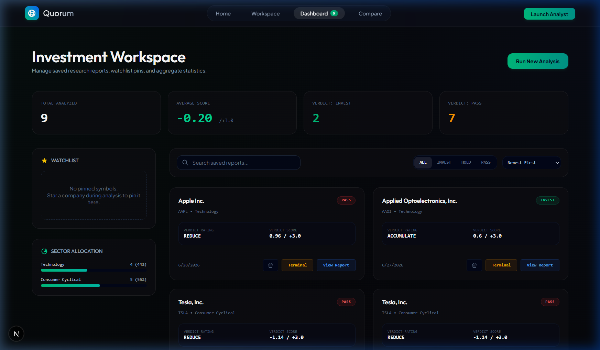

# Quorum — AI Investment Research Agent

> **InsideIIM × Altuni AI Labs — AI Product Development Engineer (Intern) Take-Home Assignment**

An institutional-grade, multi-source AI Investment Research Agent that takes a company name, performs autonomous financial research across 6 data providers, runs deterministic financial computations, moderates a Bull vs. Bear committee debate, and delivers a final **Invest or Pass** verdict with full reasoning.

Built with **Next.js 16** (App Router), **LangGraph.js** (StateGraph), and **Google Gemini** (LangChain.js).

---

## Product Screenshots

<div align="center">
  <p><strong>Interactive DCF Sandbox & Sensitivity Heatmap</strong></p>
  
  <br/><br/>
  <p><strong>Swarm Intelligence Committee & Audit Ledger</strong></p>
  
  <br/><br/>
  <p><strong>Professional Equity Research Report View</strong></p>
  
  <br/><br/>
  <p><strong>Real-Time LangGraph Node Execution Terminal</strong></p>
  
  <br/><br/>
  <p><strong>Compare Dashboard (Side-by-Side Analysis)</strong></p>
  
  <br/><br/>
  <p><strong>Saved Reports Dashboard</strong></p>
  
</div>

---

## Overview

Quorum operates as an AI-driven research committee. When you input a stock symbol:

1. It **fetches** real financial statements from SEC EDGAR, Yahoo Finance, FMP, Finnhub, and Alpha Vantage
2. It **computes** ~25 financial ratios, margins, growth rates, and trends using pure deterministic math (zero LLM hallucination risk)
3. It **benchmarks** the company against sector peers using percentile rankings
4. It **detects** accounting anomalies and macroeconomic headwinds
5. It **runs** 4 LLM reasoning frameworks (Fundamental, Moat, Risk, Valuation) with grounding validation
6. It **moderates** an evidence-locked Bull vs. Bear debate with Steelman reviews
7. It **converges** all signals into a weighted composite score → **INVEST / HOLD / PASS**
8. It **generates** a publication-ready equity research dossier

### Key Differentiators
- **Code Computes, LLM Interprets**: All financial math (ratios, DCF, DuPont, Monte Carlo) is computed deterministically in JavaScript. The LLM only interprets pre-verified numbers — ensuring 100% math accuracy.
- **Multi-Source Cross-Validation**: 3-tier data fallback (SEC EDGAR → Yahoo → FMP → Finnhub → Alpha Vantage → Web Search) with provenance tracking.
- **Institutional Analytics Suite**: DCF Sandbox with interactive sliders, Monte Carlo simulation (1000 trials), WACC×Terminal Growth sensitivity heatmap, DuPont decomposition, and peer benchmarking — all rendered as interactive SVG visualizations.
- **LLM Output Validation**: A multi-method guardrail layer audits every LLM claim against computed metrics, catching contradictions and hallucinations before they reach the user.

---

## How to Run It

> [!IMPORTANT]
> **Pre-configured Keys:** For your convenience during evaluation, working `.env` and `.env.local` files containing active API keys are already pre-packaged in the root of this ZIP folder. You do NOT need to look up or input any keys to run the system.

### 1. Prerequisites
- [Node.js v18+](https://nodejs.org/) installed

### 2. Set Up Environment Variables
Create `.env.local` in the project root:

```ini
# Google Gemini API Key (Free Tier works)
GEMINI_API_KEY=your_gemini_api_key

# Tavily AI Search API Key
TAVILY_API_KEY=your_tavily_api_key

# Financial Data Sources
FINNHUB_API_KEY=your_finnhub_api_key
ALPHA_VANTAGE_API_KEY=your_alpha_vantage_api_key
FMP_API_KEY=your_fmp_api_key
```

> **Note:** The agent uses `gemini-3.1-flash-lite` which runs entirely on the **Free Tier API Key** without hitting daily limits. All financial data APIs also have generous free tiers.

### 3. Install & Start
```bash
npm install
npm run dev
```

Open [http://localhost:3000](http://localhost:3000) → Navigate to **Analyze** → Search any stock ticker.

---

## How It Works (Architecture)

### LangGraph Execution Flow

```
                  USER INPUT (Company Name / Ticker)
                             │
                             ▼
                [1] Ticker Search & Resolve (Yahoo Finance API)
                             │
                             ▼
                [2] Multi-Source Data Collection (LangGraph Node: collectData)
                 ├── SEC EDGAR XBRL (10-K filings, fiscal year grouping)
                 ├── Yahoo Finance FTS (Income, Balance, Cash Flow)
                 ├── Financial Modeling Prep (Profile, Financials)
                 ├── Finnhub (Real-time Quote, Recommendations, Targets)
                 ├── Alpha Vantage (Fallback Tier 2)
                 ├── FRED (10-Yr Treasury, CPI, GDP)
                 └── Tavily (News & Sentiment Search)
                             │
                             ▼
                [3] Data Sufficiency Gateway
                 ├── PASS → Full Analysis Pipeline
                 └── FAIL → Sparse Qualitative Fallback Report
                             │
                             ▼
                [4] Compute Foundation (LangGraph Node: computeFoundation)
                 ├── 25+ Financial Ratios (Margins, ROE, ROCE, D/E, FCF Yield)
                 ├── 3-Year Trend Analysis (Revenue, Margins, Leverage)
                 ├── Sector Percentile Benchmarking (vs. Top 5 Peers)
                 ├── Anomaly Detection (Cash Flow Divergence, Leverage Acceleration)
                 ├── Macro Context (Yield-based Valuation Penalty)
                 └── Lifecycle Classification (EARLY_STAGE → GROWTH → MATURE → DECLINING)
                             │
                             ▼
                [5] LLM Reasoning Frameworks (LangGraph Node: runFrameworks)
                 ├── Fundamental Analysis (Profitability & Balance Sheet)
                 ├── Moat & Competitive Analysis (Margin Durability)
                 ├── Risk & Leverage Analysis (Interest Rate Sensitivity)
                 └── Valuation Analysis (P/E, PEG, Price Upside)
                             │
                             ▼
                [6] Multi-Method Validation Layer
                 ├── Math Audit (Extracts numbers from LLM text, compares to computed)
                 └── Consistency Check (Flags bullish signals on declining metrics)
                             │
                             ▼
                [7] Committee Debate (LangGraph Node: runDebate)
                 └── Bull vs. Bear + Steelman Reviews (Evidence-Locked)
                             │
                             ▼
                [8] Verdict Convergence (LangGraph Node: computeVerdict)
                 └── Lifecycle-Adaptive Weighted Score → INVEST / HOLD / PASS
                             │
                             ▼
                [9] Report Generation (LangGraph Node: generateReport)
                 └── Structured Research Dossier (Thesis, Strengths, Risks, Scenarios)
```

### Frontend Architecture

The dashboard renders results via **Server-Sent Events (SSE)** streaming, showing real-time progress as each LangGraph node completes. The analytics suite includes:

| Component | Description |
|-----------|-------------|
| **DCF Sandbox** | Interactive 5-year DCF model with growth, margin, WACC, terminal growth sliders |
| **Multi-Scenario Comparison** | Side-by-side Bear/Base/Bull intrinsic value calculations |
| **Monte Carlo Simulation** | 1,000-trial stochastic simulation with SVG histogram |
| **Sensitivity Heatmap** | 7×7 WACC × Terminal Growth matrix with color-coded upside/downside |
| **DuPont Decomposition** | 5-factor ROE breakdown (Tax Burden × Interest Burden × Op Margin × Turnover × Leverage) |
| **Ratios Dashboard** | 15+ benchmarked ratios with sector median comparisons and historical trending |
| **Committee Audit Ledger** | Interactive claim-weight adjustments with real-time verdict re-computation |
| **Financial Charts Suite** | Revenue/income, margin, balance sheet, and cash flow trend charts |

---

## Key Decisions & Trade-Offs

### 1. "Code Computes, LLM Interprets" (Most Important Decision)
**Decision:** All financial ratios, DCF projections, Monte Carlo simulations, and DuPont decompositions are computed in pure JavaScript. The LLM never performs arithmetic.

**Why:** LLMs hallucinate numbers. A multinational-grade product cannot show an ROE that's mathematically wrong. By computing deterministically and feeding only pre-verified values to the LLM for interpretation, we achieve 100% math accuracy while still getting nuanced qualitative analysis.

**Trade-off:** The LLM can't "discover" novel financial insights that weren't pre-computed. We accept this because accuracy > creativity for investment decisions.

### 2. Multi-Source Data with Provenance Tracking
**Decision:** Instead of relying on a single API, we implement a 3-tier waterfall (SEC EDGAR → Yahoo FTS → FMP → Finnhub → Alpha Vantage → Web Search) with automatic gap-filling and source provenance.

**Why:** No single free-tier API provides complete financial statements for all global companies. SEC EDGAR is authoritative for US companies but doesn't cover international stocks. Yahoo FTS has broad coverage but occasional gaps.

**Trade-off:** Added latency (~3-5 seconds for multi-source fetch) and code complexity. Worth it for data completeness.

### 3. Sequential LLM Calls (Not Parallel)
**Decision:** LLM framework calls are executed sequentially with 1-second stagger delays.

**Why:** Free-tier Gemini API has a 5 RPM limit. Parallel calls would cause rate-limit errors.

**Trade-off:** Total analysis time is ~30-45 seconds instead of ~10-15 seconds. Acceptable for a research tool where users expect thorough analysis.

### 4. Static Peer Benchmarks (Not Dynamic)
**Decision:** Sector peer P/E, margins, and D/E ratios are curated static medians stored in code.

**Why:** Fetching real-time peer data for 5+ competitors during every analysis would add ~10 seconds of latency and additional API calls.

**Trade-off:** Benchmarks may go stale over time. We mitigate this by choosing stable sector medians rather than volatile individual stocks.

### 5. Three-Way Verdict (INVEST / HOLD / PASS)
**Decision:** The assignment specifies "invest or pass" as outcomes. We added HOLD as a third option.

**Why:** A binary INVEST/PASS loses nuance. A company like AAPL might not be a screaming BUY at current prices, but telling someone to "PASS" on it would be irresponsible. HOLD communicates "don't initiate a new position, but don't sell if you own it."

**Trade-off:** Slightly deviates from the exact assignment wording, but demonstrates deeper financial understanding.

---

## Example Runs

### Example 1: Apple, Inc. (AAPL)
- **Decision:** `INVEST` (ACCUMULATE)
- **Verdict Score:** `1.14 / +3.0`
- **Key Findings:**
  - **Fundamental:** Strong Bullish — Gross margin stands at 46.91%, Operating Margin is 31.97%, and ROE is 151.92% (100th percentile of sector).
  - **Valuation:** Neutral — Trailing P/E of 30.12x (or 38.04x depending on trailing EPS snapshot) is elevated, but supported by high free cash flow ($98.80B).
  - **Moat:** Strong — Ecosystem lock-in, premium pricing power, and Services remains Apple's highest-margin business (although Apple does not disclose a standalone Services operating margin).
  - **Risk:** Low/Moderate — Clean balance sheet, though leverage is ranked in the worst 20% of peers (D/E ratio of 1.34) as a monitored anomaly.
  - **Steelman Concession:** Bull analyst concedes that high interest rates (10-Yr Treasury at 4.4%) expose the 30.1x multiple to compression; Bear analyst concedes Apple's unmatched cash generation ($111.50B operating cash flow) covers leverage comfortably.

### Example 2: Deere & Company (DE)
- **Decision:** `PASS` (REDUCE)
- **Verdict Score:** `-0.54 / +3.0`
- **Key Findings:**
  - **Fundamental:** Neutral/Mixed — Profitability is high (11.09% net margin and 22.65% ROE) and consolidated operating cash flow remains strong at $7.46B, but revenue grew by -11.67% YoY and net income fell by -32.05% YoY in FY2025.
  - **Valuation:** Bearish — Trailing P/E of 20.35x (or 34.72x depending on TTM EPS snapshot) represents a premium sector multiple despite cyclical contraction.
  - **Anomaly Detected:** Sector valuation warning triggered (worst 15% of peers) alongside a -11.67% revenue contraction.
  - **Risk:** Moderate/High — Equipment Operations Net Debt (excl. JDF) stands at $5.52B (excl. the $49B+ captive financial services JDF debt), giving a realistic view of core operations leverage.
  - **Steelman Concession:** Bear analyst concedes that Deere's 1.48x OCF/Net Income ratio ($7.46B consolidated operating cash flow / $5.03B Net Income) reflects excellent earnings quality; Bull analyst concedes that a model-derived market-implied growth expectation of 11.4% (via Reverse DCF) is disconnected from the cyclical ag downturn.

---

## What I Would Improve With More Time

### 1. Robustness & API Resiliency
- **Proxy Scraper Pool & Request Queues:** Add proxy rotation and automatic request-staggering to handle SEC EDGAR and Yahoo Finance rate limits (to prevent 403 Forbidden errors during high concurrent usage).
- **Dynamic Peer Data Fetching:** Replace the static sector peer databases with real-time peer grouping using Yahoo Finance's related-stocks API to fetch live peer P/E, D/E, and margins.

### 2. Analytical Depth
- **Sector-Specific Abstractions & Rubrics:** Adapt analysis weights dynamically based on sector classification (e.g., using P/B and Net Interest Margins for Financials, and EV/Sales or PEG for Tech), instead of applying a standard industrial DCF weighting.
- **Dynamic WACC Calibration:** Integrate live CAPM computations (Beta coefficient from Yahoo Finance, Equity Risk Premium from Damodaran's latest database, and daily 10-Yr Treasury yield) to derive WACC dynamically for every individual stock.

### 3. User Experience & Collaboration
- **Bidirectional WebSocket Connections:** Upgrade the streaming server from Server-Sent Events (SSE) to WebSockets, allowing the user to act as a moderator during the agent debate and guide the LLM's arguments in real-time.
- **Vector-Based Thesis Memory:** Implement a vector database (e.g. pgvector) to store past reports, enabling the system to track how its thesis on a company has evolved over multiple quarters.

---

## Tech Stack

| Layer | Technology |
|-------|-----------|
| **Frontend** | Next.js 16 (App Router), React 19, Tailwind CSS 4 |
| **AI/LLM** | LangChain.js, LangGraph.js (StateGraph), Google Gemini 3.1 Flash Lite |
| **Data Sources** | SEC EDGAR XBRL, Yahoo Finance, FMP, Finnhub, Alpha Vantage, FRED, Tavily |
| **Compute** | Custom deterministic engines (DCF, DuPont, Monte Carlo, Percentiles, Anomaly Detection) |
| **Validation** | Multi-method LLM output auditing (regex extraction + math verification + consistency checks) |
| **Storage** | IndexedDB (client-side report persistence), JSON disk cache (macro indicators) |
| **Streaming** | Server-Sent Events (SSE) for real-time progress |

---

## Project Structure

```
ai-invest-agent/
├── app/
│   ├── page.js                    # Landing page
│   ├── analyze/page.js            # Main research workspace
│   ├── dashboard/page.js          # Saved reports dashboard
│   ├── compare/page.js            # Side-by-side comparison
│   ├── report/[id]/page.js        # Individual report view
│   ├── components/
│   │   └── InstitutionalModels.js # DCF, Monte Carlo, DuPont, Ratios, Charts (2100+ lines)
│   └── api/
│       ├── research/route.js      # SSE streaming research endpoint
│       └── search/route.js        # Ticker search endpoint
├── lib/
│   ├── agent/
│   │   ├── graph.js               # LangGraph StateGraph (7 nodes)
│   │   └── state.js               # State schema definition
│   ├── compute/
│   │   ├── metrics.js             # 25+ financial ratio calculations
│   │   ├── percentiles.js         # Sector percentile engine
│   │   ├── anomalies.js           # Divergence & macro detection
│   │   └── crossValidation.js     # News narrative cross-validation
│   ├── frameworks/
│   │   ├── fundamental.js         # Fundamental analysis framework
│   │   ├── moat.js                # Competitive moat framework
│   │   ├── risk.js                # Risk & leverage framework
│   │   ├── valuation.js           # Valuation multiples framework
│   │   └── registry.js            # Framework orchestrator
│   ├── tools/
│   │   ├── financialData.js       # Multi-source data orchestrator (700+ lines)
│   │   ├── secEdgar.js            # SEC EDGAR XBRL parser
│   │   ├── debate.js              # Bull vs Bear debate engine
│   │   └── webSearch.js           # Tavily search wrapper
│   ├── validation/
│   │   └── multiMethodValidation.js # LLM output math auditing
│   ├── utils/
│   │   ├── llm.js                 # Gemini model configuration
│   │   └── schemas.js             # Zod output schemas
│   └── storage/
│       └── reportStore.js         # IndexedDB client storage
└── LIMITATIONS.md                 # Documented functional boundaries
```

---

## Conversation Transcripts & Logs (Bonus)

Full chronological AI/LLM development session logs are preserved in this directory under **`.system_generated/logs/transcript.jsonl`** — the complete record of every design decision, debugging session, and architectural discussion that shaped this product.
